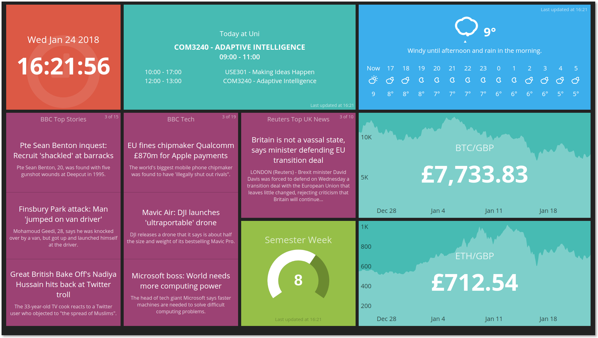

# Dave's Morning Dashboard

## Intro

I built this real-time dashboard using '[Smashing](http://smashing.github.io/)' (originally Dashing) dashboard.

The idea is that I'll run this on a Raspberry Pi hooked up to my bedroom TV at Uni.
Also running on the Pi will be an alarm clock web app. When an alarm triggers, the TV
is switched on, the dashboard is shown, and voila, I get my morning info.

I've customised a lot of the default widgets and made a few of my own as the defaults
and the user contributed ones didn't look pretty enough :D

## What Widgets do you Have?

All of the following update without the need for any page refreshes.

- Time and date
- Daily university lecture schedule, pulled from my University ICAL URL every so often
- Daily and hourly weather forecast
- Various news feeds
- The semester's week number (shows how far through Uni I am)
- Cryptocurrency graphs with real-time prices

## Usage

See the Smashing project for details.

You'll need to fill out the environmental variables in .env in order to use some
widgets I've made.
